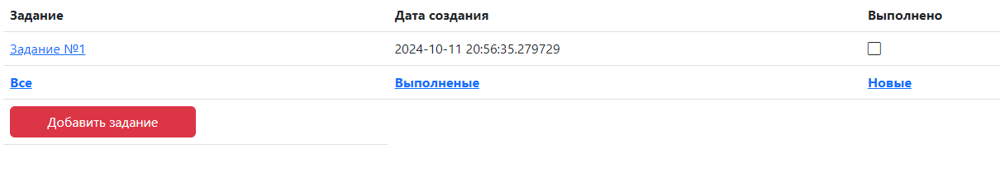

### job4j_todo

#### Описание

#### Описание:

Тестовое задание "TODO list".

В данном задании разрабатывается сайт для хранения и редактирования списка заданий.

#### Основные механизмы:

- Создание, редактирование, удаление заданий.

#### Стек технологий:

- Java 17, Spring Boot, Thymeleaf, Bootstrap, Liquibase, Hibernate, Lombok, PostgreSQL 15.

#### Требование к окружению:

- Java 17, Maven 3.8, PostgreSQL 15 ;

#### Запуск проекта:
1. На машину, на которой предполагается запуск проекта необходимо установить PostgreSQL 15.
2. Создать БД под названием todo.
3. Логин и пароль от пользователя вашей БД указать в файле job4j_cinema\src\main\resources\hibernate.cfg, либо изначально установить логин и пароль БД как в проекте(postgres и password).
4. В Intellij IDEA в Profiles поставить галку напротив production.
5. Выполняем mvn install -Pproduction -Dmaven.test.skip=true (либо mvn install -Pproduction -DskipTests=true) в консоли. Данная команда создаст и заполнит таблицы БД todo данными из скриптов в папке db\scripst.
6. Запускаем проект в Intellij IDEA.
7. В браузере идем по ссылке http://localhost:8080/

#### Взаимодействие с приложением:

Ключевыми пунктами в приложении являются: 
-кнопка "Добавить задание":

- внутри вида каждого задания кнопки "Выполнено", "Редактировать", "Удалить":
- 

#### Контакты:
- telegram: wymbrat
- email: paramonovdn@mail.ru

